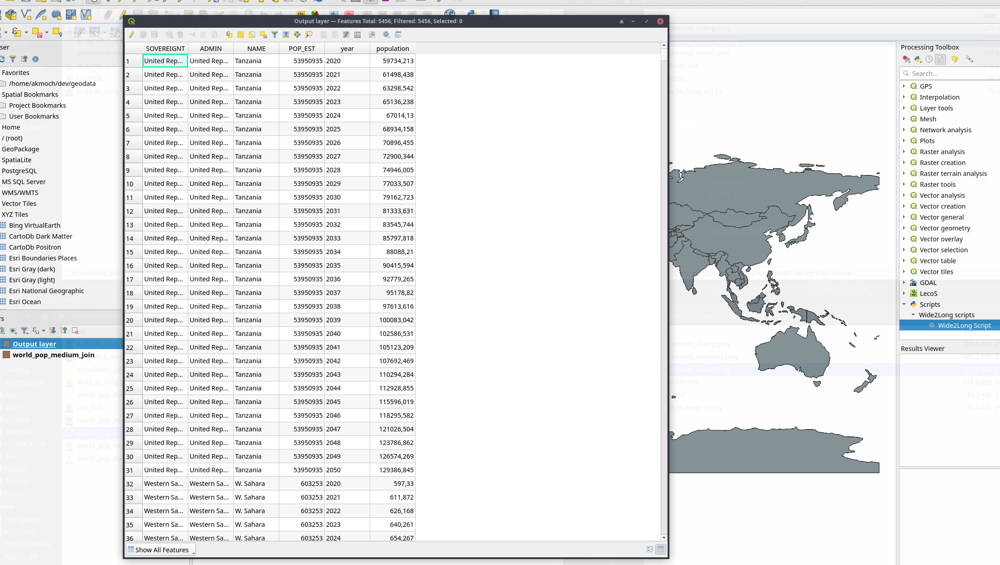

# QgisWide2Long_plugin

A small QGIS 3 processing plugin, to convert wide-column attribute vector data into long format.

## Installation

Download the "wide_to_long_alg.py" Python file, and then add it to your QGIS 3 toolbox via "Add Script to toolbox".

## How to use

Assume you have a vector dataset where each record has many attributes of the same type, that represent a series (often a timeseries).
In this example here, the wide format is population per country, but for several years (2020-2022).

| country_name | iso | 2020   | 2021   | 2022   |
|--------------|-----|--------|--------|--------|
| Colombia     | COL | 50882  | 51265  | 51512  | 
| Nigeria      | NGA | 206139 | 211400 | 216746 | 

And for e.g. visualisation purposes you need to have the value of population accessible as single column per year with a stable attribute name, but you also need to keep track from which year (column) the value came, something like that:

| country_name | iso | data_value | column_name |
|--------------|-----|------------|-------------|
| Colombia     | COL | 50882      | 2020        |
| Nigeria      | NGA | 206139     | 2020        |
| Colombia     | COL | 51265      | 2021        |
| Nigeria      | NGA | 211400     | 2021        |
| Colombia     | COL | 51512      | 2022        |
| Nigeria      | NGA | 216746     | 2022        |

And you want to choose how to name the transposed columns, e.g.:

- data_value -> population
- column_name -> year

| country_name | iso | population | year        |
|--------------|-----|------------|-------------|
| Colombia     | COL | 50882      | 2020        |
| Nigeria      | NGA | 206139     | 2020        |
| Colombia     | COL | 51265      | 2021        |
| Nigeria      | NGA | 211400     | 2021        |
| Colombia     | COL | 51512      | 2022        |
| Nigeria      | NGA | 216746     | 2022        |

That's what you can do with this plugin :smile:

## Screenshots

